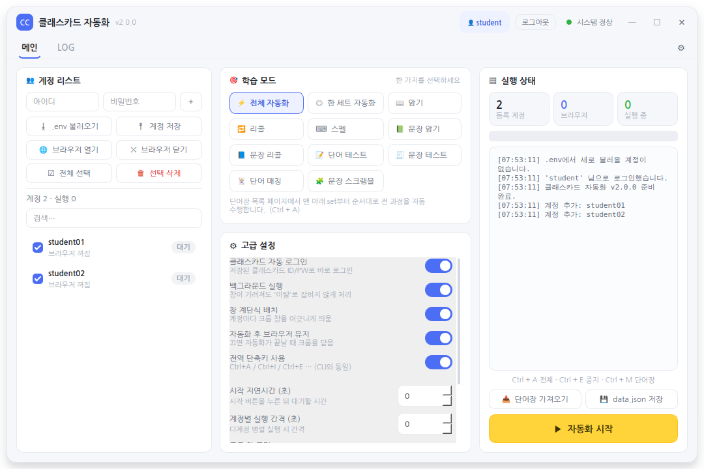
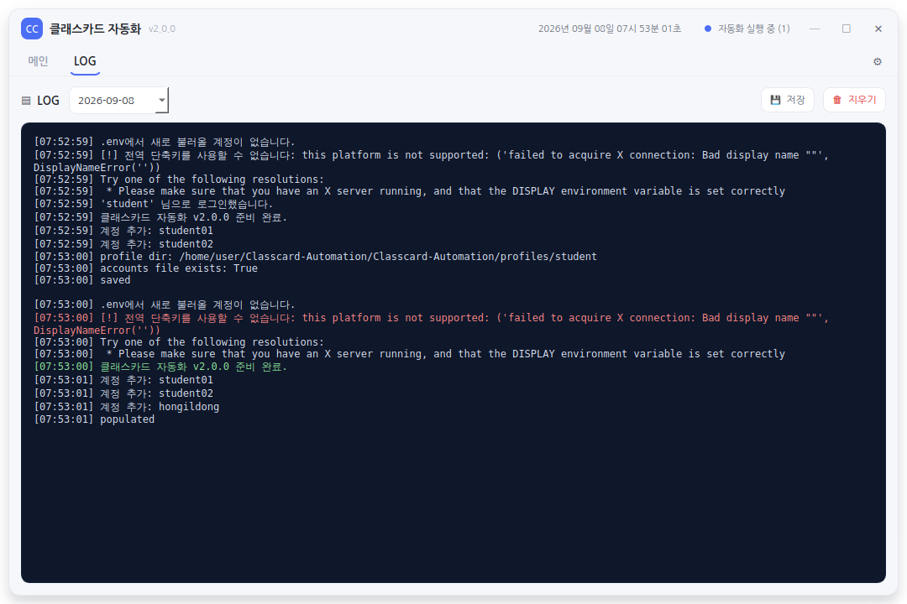
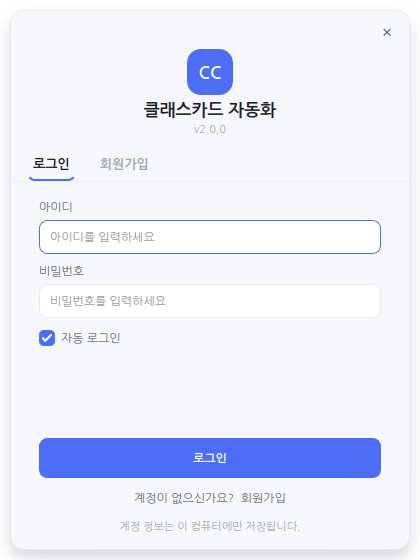
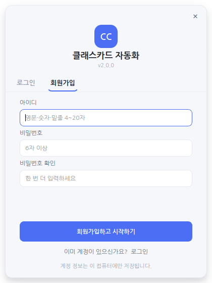

<a id="readme-top"></a>
[![Contributors][contributors-shield]][contributors-url]
[![Forks][forks-shield]][forks-url]
[![Stargazers][stars-shield]][stars-url]
[![Issues][issues-shield]][issues-url]
[![Unlicense License][license-shield]][license-url]

<!-- PROJECT LOGO -->
<br />
<div align="center">
  <a href="https://github.com/youngmin0/Classcard-Automation">
    
  </a>

  <h3 align="center">Classcard Automation</h3>

  <p align="center">
    클래스카드(Classcard)의 암기, 리콜, 스펠, 테스트 학습을 자동화하는 Python 프로그램입니다.
    단어장 전체 자동 학습(전체 자동화)과 여러 계정 동시(병렬) 실행을 지원하며,
    <b>데스크톱 GUI</b>와 기존 <b>단축키(CLI)</b> 두 가지 방식으로 모두 쓸 수 있습니다.
    <br />
    <a href="https://github.com/youngmin0/Classcard-Automation"><strong>GitHub »</strong></a>
    <br />
    <br />
  </p>
</div>

<br />

## About The Project

이 프로젝트는 클래스카드의 반복적인 학습 과정(암기, 리콜, 스펠, 테스트)을 자동화하여, 학습 시간을 절약하기 위해 개발되었습니다.

Selenium을 사용하여 웹 브라우저를 제어하고, Pynput을 통해 글로벌 단축키를 지원하며,
PySide6(Qt)로 만든 GUI에서 계정/모드/옵션을 클릭만으로 조작할 수 있습니다.

<div align="center">
  
  <br />
  
</div>

* **GUI(신규)**: 계정 관리, 학습 모드 선택, 고급 설정(자동 로그인·백그라운드 실행·지연시간·예약 실행),
  실시간 로그(날짜별 저장/불러오기)를 한 화면에서 사용. 기존 단축키도 그대로 동작
* **회원가입 / 로그인(신규)**: 프로그램을 켜면 로그인 창이 먼저 뜨고, 로그인한 사용자마다
  클래스카드 계정 목록과 설정이 따로 저장됨. 비밀번호는 PBKDF2 해시로만 보관하며 서버가 필요 없음
* **자동 로그인**: `.env` 파일의 ID/PW로 자동 로그인
* **다계정 병렬 실행**: `.env`에 여러 계정을 적으면(쉼표 구분) `python main.py` 한 번으로
  계정 수만큼 크롬 창이 열려 각각 로그인. 단축키 한 번이면 **모든 계정이 동시에** 같은 자동화를 수행
  (계정마다 다른 set이어도 각자 자기 단어장으로 동작).
  창은 데스크톱 레이아웃 유지를 위해 큰 크기로 계단식으로 겹쳐 띄웁니다. 포커스가 없거나 창이
  겹쳐도 백그라운드에서 정상 동작하니, **창 크기를 줄이지 마세요**(좁아지면 클래스카드가 모바일
  레이아웃으로 바뀌어 문장 테스트/리콜 등이 깨집니다).
* **암기(Memorize)**: 단어/문장 암기 자동화
* **리콜(Recall)**: 단어/문장 리콜 자동화
* **스펠(Spell)**: `data.json`의 정답 목록을 기반으로 자동으로 정답을 타이핑.
  전체 자동화에서는 선생님이 **필수로 지정한 단어 set**에서만 수행(자율이면 건너뜀)
* **테스트(Test, 단어)**: 단어 객관식 테스트 자동 풀이. `data.json` 기반 양방향(영↔한) 매칭으로
  정답 보기를 골라 입력. 항상 100점이 되지 않도록 일부 문항은 랜덤 오답 처리(단, **70점 초과 보장**).
  탭/창 포커스를 잃어도 '이탈'로 잡히지 않아 **백그라운드 실행** 가능
* **테스트(Test, 문장)**: 문장 어순 배열 테스트 자동 풀이. 한글 문제 → `data.json`에서 영어 정답
  문장을 찾아 스크램블 단어를 어순대로 클릭. 실시간 채점에 대응하기 위해 **CDP 트러스티드 클릭**으로
  입력하며, 괄호 묶음 `(...)`·대소문자 중복(`The`/`the`)·구두점 차이를 모두 정규화해 매칭.
  0~1개만 랜덤 오답 처리(**90점 패스 기준** 안전 통과). 단어 테스트와 동일하게 **백그라운드 실행** 가능
* **매칭(Matching, 단어)**: 영어↔한국어 카드 매칭 게임 자동 풀이. 페이지의 `card_list`를
  직접 읽어 짝을 찾아 클릭. 목표 점수(**1000~2000점 랜덤**)에 도달하면 게임 도중에
  자동으로 빠져나옴(필수 1000점 충족, 점수 저장됨). **백그라운드 실행** 가능
* **스크램블(Scramble, 문장)**: 문장 어순 배열 게임 자동 풀이. 페이지의 `study_data`를
  읽어 한글 문제에 해당하는 영어 문장을 찾고, 단어 타일을 어순대로 클릭. 목표 점수
  (**4000~5000점 랜덤**)에 도달하면 빠져나옴(필수 4000점 충족, 점수 저장됨). **백그라운드 실행** 가능
* **단어장 가져오기**: 현재 페이지에서 단어 데이터를 `data.json`으로 추출
* **전체 자동화(AutoAll)**: 단어장 목록 페이지에서 맨 아래 set부터 위로 올라가며
  단어/문장 자동 판별 → 학습구간을 '전체 카드 학습'으로 변경 → `data.json` 자동 업데이트 →
  암기 → 리콜 → 스펠 → 매칭/스크램블 → 테스트를 차례로 수행
  (단어 set은 (필수면)스펠+매칭+단어 테스트, 문장 set은 스크램블+문장 테스트).
  이미 완료된 모드와 set은 자동으로 스킵
  (테스트는 최고점수가 단어 70점 / 문장 90점, 매칭은 1000점 / 스크램블은 4000점 이상이면 스킵)
* **한 세트 자동화**: 셋홈(set 상세) 페이지를 열어둔 상태에서 `Ctrl + Alt + S`를 누르면
  그 한 set만 전체 모드(암기→리콜→(필수면)스펠→매칭/스크램블→테스트)를 수행하고 멈춤

<p align="right">(<a href="#readme-top">back to top</a>)</p>

### Built With

* [![Selenium][Selenium-shield]][Selenium-url]
* [![PySide6][PySide6-shield]][PySide6-url]
* [![Pynput][Pynput-shield]][Pynput-url]
* [![BeautifulSoup][BeautifulSoup-shield]][BeautifulSoup-url]

<p align="right">(<a href="#readme-top">back to top</a>)</p>

## Getting Started

로컬 환경에서 이 스크립트를 설정하고 실행하기 위한 단계입니다.

### Prerequisites

* **Python 3.x**
* **Google Chrome** 브라우저

### Installation

1. GitHub 저장소를 복제(Clone)합니다.
```sh
git clone https://github.com/youngmin0/Classcard-Automation.git
```
2. 프로젝트 폴더로 이동합니다.
```sh
cd Classcard-Automation
```
3. Python 라이브러리를 설치합니다.
```sh
pip install -r requirements.txt
```
4. `.env.example`을 복사하여 `.env` 파일을 만들고 클래스카드 ID/PW를 입력합니다.
```sh
cp Classcard-Automation/.env.example Classcard-Automation/.env
```
```
CLASSCARD_ID=내_아이디
CLASSCARD_PW=내_비밀번호
```
여러 계정을 동시에 돌리려면 쉼표(,)로 구분해 적습니다. (ID와 PW의 순서·개수를 맞출 것)
```
CLASSCARD_ID=계정1,계정2,계정3
CLASSCARD_PW=비번1,비번2,비번3
```

<p align="right">(<a href="#readme-top">back to top</a>)</p>

## Usage

프로그램은 **GUI**와 **CLI(단축키)** 두 가지로 실행할 수 있습니다. 자동화 엔진은 완전히 동일합니다.

### 1) GUI로 실행하기 (권장)

Windows에서는 저장소 폴더의 **`run_gui.bat`을 더블클릭**하면 필요한 라이브러리를 자동으로 설치한 뒤
GUI가 열립니다. 직접 실행하려면:

```sh
cd Classcard-Automation
python gui.py
# 또는
python main.py --gui
```

**회원가입 / 로그인**

<div align="center">
  
  
</div>

처음 실행하면 **회원가입** 탭이 먼저 열립니다. 아이디(영문·숫자·밑줄 4~20자)와 비밀번호(6자 이상)를
정하면 바로 로그인되고 메인 화면이 열립니다.

* **자동 로그인**: 체크해 두면 다음 실행부터 로그인 창 없이 바로 시작합니다.
  (임의 토큰을 `auth_session.json`에 저장하고, DB에는 토큰의 해시만 보관)
* **로그아웃**: 오른쪽 위 `로그아웃` 버튼 → 자동 로그인이 해제되고 로그인 창으로 돌아갑니다.
* **비밀번호 변경**: `⚙ 환경설정` → *로그인 계정* 항목에서 현재/새 비밀번호를 입력해 변경합니다.
* **사용자별 분리**: 로그인한 사용자마다 `profiles/<아이디>/`에 클래스카드 계정 목록(`accounts.json`)과
  설정(`gui_settings.json`)이 따로 저장됩니다. 처음 로그인할 때 기존 `.env` 계정을 자동으로 물려받습니다.
* **저장 위치**: 사용자 정보는 이 컴퓨터의 `Classcard-Automation/users.db`(SQLite)에만 저장되며,
  비밀번호는 PBKDF2-HMAC-SHA256(솔트 + 24만 회 반복) 해시로만 보관합니다. 서버로 아무것도 보내지 않습니다.

> 클래스카드 계정(ID/PW)은 이 로그인과 별개입니다. 클래스카드 계정 비밀번호는 자동화를 위해
> `accounts.json` / `.env`에 그대로 저장되므로, 공용 PC에서는 사용 후 삭제하세요.

**화면 구성**

| 영역 | 설명 |
|------|------|
| **계정 리스트** | 아이디/비밀번호를 입력해 계정 추가, `.env 불러오기`/`계정 저장`, `브라우저 열기/닫기`, 검색, 선택 삭제. 계정 줄을 더블클릭하면 비밀번호를 바꿀 수 있습니다. 체크된 계정만 실행 대상이 됩니다 |
| **학습 모드** | 전체 자동화 · 한 세트 자동화 · 암기 · 리콜 · 스펠 · 문장 암기 · 문장 리콜 · 단어 테스트 · 문장 테스트 · 단어 매칭 · 문장 스크램블 중 하나 선택 |
| **고급 설정** | 클래스카드 자동 로그인 / 백그라운드 실행(이탈 감지 우회) / 창 계단식 배치 / 자동화 후 브라우저 유지 / 전역 단축키 사용 / 시작 지연시간 / 계정별 실행 간격 / 크롬 창 크기 / **예약 실행**(지정 시각에 자동 시작) |
| **실행 상태** | 등록 계정·브라우저·실행 중 개수, 진행 표시, 최근 로그, `단어장 가져오기`, `data.json 저장`, 큰 **자동화 시작/중지** 버튼 |
| **LOG 탭** | 날짜별 로그 조회(`logs/YYYY-MM-DD.log`), 저장, 지우기 |
| **⚙ 환경설정** | 크롬 실행 파일 경로, 추가 크롬 인자, 로그인 비밀번호 변경, 로그 폴더 열기 |

설정은 로그인한 사용자의 `profiles/<아이디>/gui_settings.json`에 자동 저장되어 다음 실행 때 그대로 복원됩니다.
GUI를 켠 상태에서도 아래 **전역 단축키가 그대로 동작**합니다(고급 설정에서 끌 수 있음).

### 2) CLI(단축키)로 실행하기

1. 터미널에서 `main.py`를 실행합니다.
```sh
cd Classcard-Automation
python main.py
```
2. Chrome 브라우저가 열리고 자동으로 로그인됩니다. (`.env` 미설정 시 수동 로그인)
   - 여러 계정을 설정한 경우 계정 수만큼 창이 열리며, 아래 단축키는 **모든 계정에 동시에** 적용됩니다.
3. 자동화 방식 선택:
   - **개별 모드**: 학습 세트 페이지로 직접 이동한 뒤 `Ctrl + M`으로 단어 추출 → 원하는 모드 단축키 사용
   - **전체 자동화**: 단어장 목록 페이지(여러 set이 보이는 페이지)에서 `Ctrl + A` 한 번. 맨 아래 set부터 위로 순차 처리
4. 아래 단축키를 사용하여 자동화를 제어합니다.

| 단축키 | 기능 |
|--------|------|
| `Ctrl + A` | **전체 자동화** 시작 (단어장 목록 페이지에서) |
| `Ctrl + Alt + S` | **한 세트 자동화** 시작 (열어둔 셋홈 페이지에서) |
| `Ctrl + I` | **암기** 자동화 시작 |
| `Ctrl + Y` | **리콜** 자동화 시작 |
| `Ctrl + X` | **스펠** 자동화 시작 |
| `Ctrl + B` | **문장 암기** 자동화 시작 |
| `Ctrl + Q` | **문장 리콜** 자동화 시작 |
| `Ctrl + Alt + G` | **단어 테스트** 자동화 시작 |
| `Ctrl + Alt + H` | **문장 테스트** 자동화 시작 |
| `Ctrl + Alt + J` | **단어 매칭** 자동화 시작 |
| `Ctrl + Alt + K` | **문장 스크램블** 자동화 시작 |
| `Ctrl + M` | **단어장 가져오기** (현재 페이지에서 데이터 추출) |
| `Ctrl + E` | 현재 자동화 **중지** |
| `Ctrl + Esc` | 프로그램 **전체 종료** (브라우저 닫힘) |

> 리눅스에 X 서버가 없거나 macOS 접근성 권한이 없으면 pynput(전역 단축키)을 쓸 수 없습니다.
> 이때는 GUI(`python main.py --gui`)로 실행하면 버튼으로 모든 기능을 쓸 수 있습니다.

### 3) 실행 파일(.exe)로 만들기

```sh
pip install pyinstaller
pyinstaller --noconfirm --clean classcard_gui.spec
# -> dist/ClasscardAutomation.exe
```

`.env`는 실행 파일에 포함되지 않습니다. exe와 같은 폴더에 `.env`를 두거나 GUI에서 계정을 추가한 뒤
`계정 저장`을 누르세요.

<p align="right">(<a href="#readme-top">back to top</a>)</p>

## Roadmap

- [x] 자동 로그인 기능
- [x] 단어장 자동 추출 기능
- [x] 문장 암기/리콜 지원
- [x] 단어장 전체 자동화 (Ctrl + A)
- [x] 단어 테스트 자동화 (Ctrl + Alt + G) + 백그라운드 실행
- [x] 문장 테스트 자동화 (Ctrl + Alt + H) + 백그라운드 실행
- [x] 단어 매칭 자동화 (Ctrl + Alt + J) + 백그라운드 실행
- [x] 문장 스크램블 자동화 (Ctrl + Alt + K) + 백그라운드 실행
- [x] 다계정 동시(병렬) 실행
- [x] GUI 인터페이스 추가 (PySide6) — 계정 관리 / 모드 선택 / 고급 설정 / 예약 실행 / LOG 뷰어
- [x] 회원가입 / 로그인 (로컬 계정, 자동 로그인, 사용자별 프로필 분리)
- [ ] 세트별 진행률 표시

See the [open issues](https://github.com/youngmin0/Classcard-Automation/issues) for a full list of proposed features (and known issues).

<p align="right">(<a href="#readme-top">back to top</a>)</p>

## Contributing

Contributions are what make the open source community such an amazing place to learn, inspire, and create. Any contributions you make are **greatly appreciated**.

If you have a suggestion that would make this better, please fork the repo and create a pull request. You can also simply open an issue with the tag "enhancement".
Don't forget to give the project a star! Thanks again!

1. Fork the Project
2. Create your Feature Branch (`git checkout -b feature/AmazingFeature`)
3. Commit your Changes (`git commit -m 'Add some AmazingFeature'`)
4. Push to the Branch (`git push origin feature/AmazingFeature`)
5. Open a Pull Request

### Top contributors:

<a href="https://github.com/youngmin0/Classcard-Automation/graphs/contributors">
  
</a>

<p align="right">(<a href="#readme-top">back to top</a>)</p>

## License

Distributed under the Unlicense License. See `LICENSE.txt` for more information.

<p align="right">(<a href="#readme-top">back to top</a>)</p>

## Contact

youngmin0

Project Link: [https://github.com/youngmin0/Classcard-Automation](https://github.com/youngmin0/Classcard-Automation)

<p align="right">(<a href="#readme-top">back to top</a>)</p>

## Acknowledgments

* [Img Shields](https://shields.io)
* [Choose an Open Source License](https://choosealicense.com)
* [Best-README-Template](https://github.com/othneildrew/Best-README-Template)

<p align="right">(<a href="#readme-top">back to top</a>)</p>

[contributors-shield]: https://img.shields.io/github/contributors/youngmin0/Classcard-Automation.svg?style=for-the-badge
[contributors-url]: https://github.com/youngmin0/Classcard-Automation/graphs/contributors
[forks-shield]: https://img.shields.io/github/forks/youngmin0/Classcard-Automation.svg?style=for-the-badge
[forks-url]: https://github.com/youngmin0/Classcard-Automation/network/members
[stars-shield]: https://img.shields.io/github/stars/youngmin0/Classcard-Automation.svg?style=for-the-badge
[stars-url]: https://github.com/youngmin0/Classcard-Automation/stargazers
[issues-shield]: https://img.shields.io/github/issues/youngmin0/Classcard-Automation.svg?style=for-the-badge
[issues-url]: https://github.com/youngmin0/Classcard-Automation/issues
[license-shield]: https://img.shields.io/github/license/youngmin0/Classcard-Automation.svg?style=for-the-badge
[license-url]: https://github.com/youngmin0/Classcard-Automation/blob/master/LICENSE.txt
[Selenium-shield]: https://img.shields.io/badge/Selenium-43B02A?style=for-the-badge&logo=selenium&logoColor=white
[Selenium-url]: https://www.selenium.dev/
[PySide6-shield]: https://img.shields.io/badge/PySide6-41CD52?style=for-the-badge&logo=qt&logoColor=white
[PySide6-url]: https://doc.qt.io/qtforpython/
[Pynput-shield]: https://img.shields.io/badge/Pynput-informational?style=for-the-badge&logo=python&logoColor=white
[Pynput-url]: https://pynput.readthedocs.io/
[BeautifulSoup-shield]: https://img.shields.io/badge/BeautifulSoup-informational?style=for-the-badge&logo=python&logoColor=white
[BeautifulSoup-url]: https://www.crummy.com/software/BeautifulSoup/
